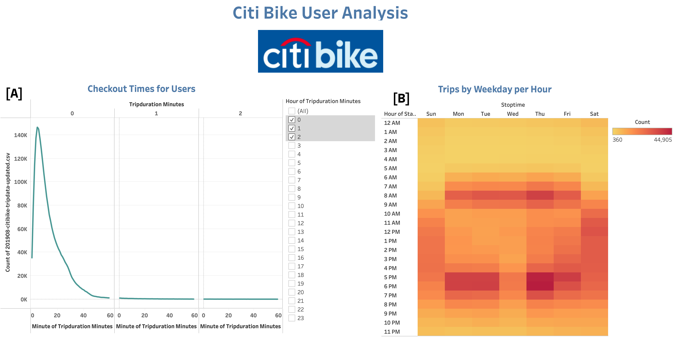
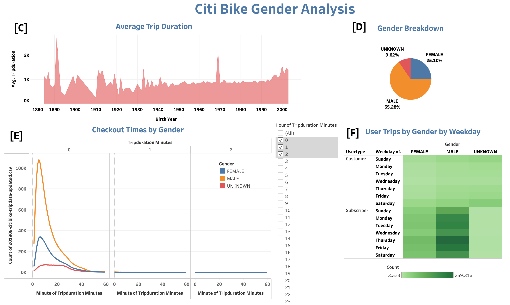
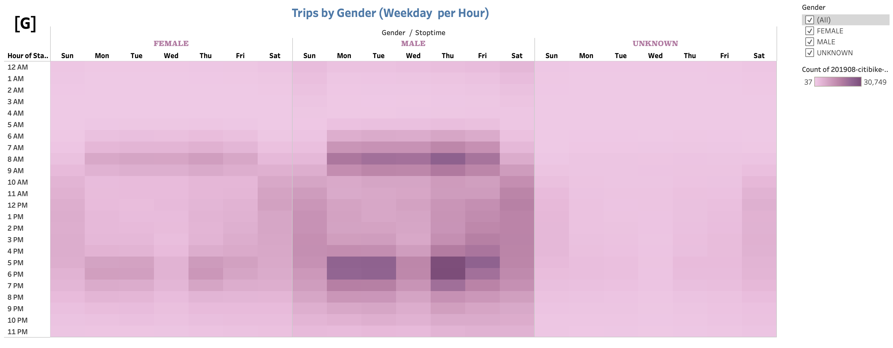

# bikesharing

## Overview of the statistical analysis:
   * The purpose of this statistical analysis is to convince investors that a bike-sharing program in Des Moines is a solid business proposal. For this analysis we first used Pandas to change the "tripduration" column from an integer to a datetime datatype. Then, using the converted datatype, we leveraged tableau to create various visualizations that were compiled into a story comprised of two different dashboards. This will undoubtedly make presenting the data much easier and will tell the full story we want to portray. Morevoer, by using Tableau we were able to show the length of time that bikes are checked out for all riders and genders, number of bike trips for all riders and genders for each hour of each day of the week, number of bike trips for each type of user and gender for each day of the week and more! Below is the story we compiled along with an explanation. 

## Results:
   * As mentioned previously, our story is comprised of two dashboards. The first dashboard provides an overall analysis of citibike data while the second dashboard focuses solely on Gender. In order to make it easier for our audience to follow along with our presentation, each visualization/graph was given a letter. Our explanation(s) for our graphics will reference these letters as well. 
     * Citi Bike User Analysis: Our first analysis was concentrated on bike usage as this will help give investors an idea how long bikeshares are used and during what time. See below for our first story point.
         
       * Referencing Graphic [A], trip duration for all citi bike customers is generally between 20-40 minutes and most certainly under an hour. Moreover, referencing image [B], we can see that customers likely use citi bikes to commute to and from work due to the concentration of activity during 6-9am and 4-7pm) on weekdays. However, on weekends, activity is evenly spread during daylight hours.  
     * Gender/Age Focus: In order to ensure future success, it important to understand who the customers are based on age and gender. Therefore, our next story point is a dashboard that demonstrates Average Trip duration by birth year as well as a breakdown on Gender stats. See below.
         
         
       * As seen in graphic [C], the majority of trip users are generally above the birth year of 1950. Additionally, the customers with the birthyear above 1995 had higher average trip durations. In regards to Gender, as seen in graphic [D], over half [65.28%) of citibike customers were male while only 25.10% were females. Perhaps using more advertisements to target females in the future will help increase the female usage numbers. In regards to check out times, graphic [E} demonstrates once again that Males are the top users for citibikes. Moreoover, as seen in graphic [F], Males are the majority of subscribers and use citibikes fairly consistently throughout the week. Graphic [G] also supports this as we see Males likely are the primary users who leverage citibikes as transportation to and from work.    

## Summary:
   * Overall, this analysis helped us understand the age range and gender of citibike's top customers. Males are undboutedly the majority of subscribers and likely depend on Citi bike for work transportation. This is a big indicator citibike needs to tailor their marketing campaign to target more women. In order to help with this, I would recommend a graphic demonstrating where the majority of female customers are located on a map and where are the least amount. This will help guide the marketing team's efforts. Another visualization I would recommend is showing a pie chart comparing the percentage of subscribers vs non subscribers and then plot on the map where the non subscribers are. This would also be helpful in guiding the marketing team's efforts to get more subsribers. Below is the link to the full story/dashboard.
     * [Link to Tableau Story/Dashboard](https://public.tableau.com/views/CitibikeAnalysis_16550881514350/Final_Story_Morales?:language=en-US&publish=yes&:display_count=n&:origin=viz_share_link)

